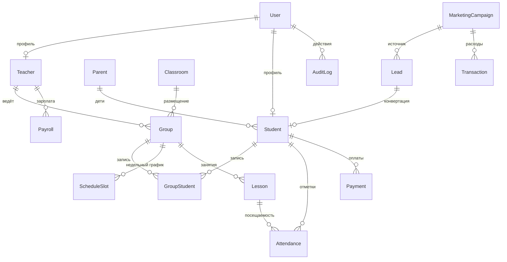

# Han Bridge CRM — Архитектура

## 1. Обзор

```
                         ┌─────────────┐
        Браузер  ───────▶│    nginx    │  :80
                         └──────┬──────┘
                   /            │            /api, /docs
            ┌──────▼──────┐     │     ┌──────▼──────┐
            │  frontend   │     │     │   backend   │
            │  Next.js 15 │     │     │   NestJS    │
            └─────────────┘     │     └──────┬──────┘
                                │            │ Prisma
                          ┌─────▼─────┐ ┌────▼─────┐
                          │   redis   │ │ postgres │
                          └───────────┘ └──────────┘
```

- **Frontend** — Next.js 15 (App Router), Tailwind + ShadCN-style компоненты, recharts, next-themes (light/dark).
- **Backend** — NestJS, REST + Swagger, JWT-аутентификация, RBAC через guards, Prisma ORM.
- **БД** — PostgreSQL (данные), Redis (кэш/очереди уведомлений — задел).
- **nginx** — единая точка входа: `/` → frontend, `/api` → backend, `/docs` → Swagger.

## 2. ERD (основные связи)



Полное определение — [`backend/prisma/schema.prisma`](../backend/prisma/schema.prisma).

### Ключевые сущности

| Модель              | Назначение |
| ------------------- | ---------- |
| `User`              | Учётка + роль (RBAC). |
| `Student` / `Parent`| CRM студентов и родители. |
| `Teacher`           | Ставка, тип оплаты, специализация. |
| `Group`             | Группа **или** индивидуальный курс (capacity 1). Цена/мес. |
| `GroupStudent`      | M:N запись студентов в группы. |
| `ScheduleSlot`      | Недельный повторяющийся слот (день+время+аудитория). |
| `Lesson`            | Конкретное занятие (для посещаемости и подсчёта часов). |
| `Attendance`        | Был / не был / опоздал / уважит. |
| `Payment`           | Оплата абонемента (период, статус, метод). |
| `Transaction`       | Доход/расход с категорией и привязкой к группе/преподавателю/кампании. |
| `Payroll`           | Зарплатная ведомость (часы×ставка ± бонусы/штрафы). |
| `Lead`              | Воронка продаж (этап + источник). |
| `MarketingCampaign` | Кампания, бюджет, заявки, ROI. |
| `AuditLog`          | Кто/что/когда изменил. |
| `Notification`      | Очередь Telegram-уведомлений. |

## 3. Бизнес-формулы (реализованы в backend)

- **Зарплата преподавателя** = `Σ часов/мес × ставка`; `часы/мес = часы/нед × 4` (4 учебных недели в месяце).
- **Доход группы** = `цена/мес × число активных студентов`.
- **Прибыль группы** = `Доход − (часы группы × ставка) − расходы группы`.
- **Рентабельность** = `Прибыль / Доход × 100%`.
- **Маржа школы** = `(Доход − Расход) / Доход × 100%`.
- **ROI кампании** = `((Доход − Бюджет) / Бюджет) × 100%`.

## 4. RBAC

8 ролей (`SUPER_ADMIN, DIRECTOR, ADMINISTRATOR, ACCOUNTANT, SALES_MANAGER, TEACHER, STUDENT, PARENT`).
`SUPER_ADMIN` имеет доступ ко всему. Защита — `JwtAuthGuard` (глобально) + `RolesGuard` + `@Roles()`.
Owner Dashboard и аудит — только `DIRECTOR` / `SUPER_ADMIN`.

## 5. Основные API-эндпоинты

| Метод | Путь                         | Роли |
| ----- | ---------------------------- | ---- |
| POST  | `/auth/login`                | public |
| GET   | `/auth/me`                   | любой авторизованный |
| GET   | `/dashboard`                 | авторизованный |
| GET   | `/students` `/students/:id`  | авторизованный |
| POST/PATCH/DELETE | `/students*`     | director/admin/sales |
| GET   | `/teachers` `/teachers/:id`  | расчёт нагрузки/зарплаты |
| GET   | `/groups` `/groups/:id`      | расчёт доходности |
| POST  | `/groups/:id/enroll`         | director/admin |
| GET   | `/finance/analytics`         | director/accountant/admin |
| GET   | `/finance/owner-overview`    | **director** |
| GET   | `/payments` `/payments/overdue` | — |
| POST  | `/attendance/mark`           | teacher/director/admin |
| GET   | `/leads`                     | sales-воронка |
| POST  | `/leads/:id/convert`         | конвертация в студента |
| GET   | `/audit-logs`                | **director/super-admin** |

Полный список с телами запросов — Swagger `/docs`.

## 6. Резервное копирование

- Ручной бэкап: `scripts/backup.ps1` / `scripts/backup.sh` (`pg_dump | gzip` → `./backups`).
- Восстановление: `scripts/restore.ps1 -File ...`.
- Ежедневный бэкап: cron, вызывающий `backup.sh` (ротация по `BACKUP_RETENTION_DAYS`).
- Персистентность: Docker volumes `postgres_data`, `redis_data`.

## 7. Дорожная карта (следующие этапы)

1. **Расписание** — генерация `Lesson` из `ScheduleSlot`, drag&drop календарь, проверка коллизий аудиторий.
2. **Payroll UI** — формирование ведомости из проведённых `Lesson` + бонусы/штрафы, экспорт.
3. **Маркетинг + Unit-экономика** — CPL/CAC/LTV/ROMI, ROI по кампаниям.
4. **Уведомления** — Telegram-бот (напоминания об оплате/занятии/пропуске/окончании абонемента).
5. **Импорт/экспорт** — загрузка студентов/групп/оплат из Excel; выгрузка отчётов в PDF/Excel/CSV.
6. **AI-аналитик** — запросы на естественном языке к данным CRM (Claude API) для собственника.
